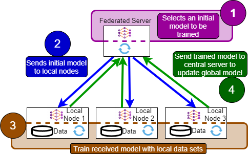

# Federated Learning Experiments performed with KDD

This repository contains the source files for the experiments performed with the NSL-KDD data set. 
The results are published in [1] and [2]

The following federated learning implementation has been considered in these experiments

## References

[1] Wijethilaka, Shalitha, and Madhusanka Liyanage. "The role of security orchestrator in network slicing for future networks." Journal of Communications and Networks 25.3 (2023): 355-369.

[2] Wijethilaka, Shalitha, and Madhusanka Liyanage. "A Federated Learning Approach for Improving Security in Network Slicing." GLOBECOM 2022-2022 IEEE Global Communications Conference. IEEE, 2022